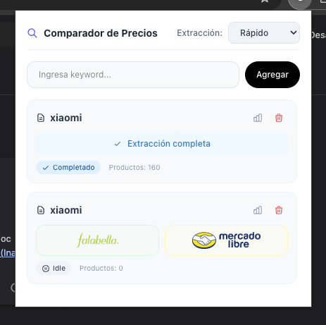
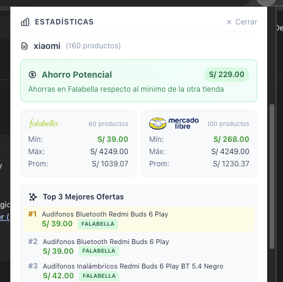
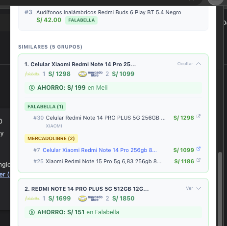

# Comparador de Precios: Falabella & Mercado Libre

> Extensión de Chrome profesional para el rastreo y comparación automática de precios en tiempo real entre Falabella y Mercado Libre Peru. Optimizada para la mejor experiencia de ahorro del usuario.


## ¿Qué es esto?

Este proyecto es una herramienta avanzada de comparación que permite a los usuarios ahorrar tiempo y dinero mediante:

- **Scraping Multi-sitio** – Extracción simultánea de datos en Falabella y Mercado Libre sin bloqueos.
- **Híper-Velocidad (JSON-First)** – Motor optimizado que extrae datos directamente de los scripts de estado, omitiendo el renderizado pesado del DOM.
- **Top 3 de Ofertas** – Acceso directo a los precios más bajos encontrados en toda la búsqueda.
- **Agrupamiento Inteligente** – Motor `ProductMatcher` que identifica productos idénticos mediante tokens.

---

## Evidencia Visual





---

## Instalación y Configuración

Este proyecto utiliza [Bun](https://bun.sh/) para una máxima velocidad de desarrollo y construcción.

### 1. Clonar y Preparar

```bash
# Clonar el proyecto
git clone https://github.com/IvyedSG/reto-uno
cd reto-uno

# Instalar dependencias
bun install
```

### 2. Construcción de la Extensión

Ejecuta el comando de build para generar la carpeta `dist/` lista para ser cargada en Chrome:

```bash
bun run build
```

### 3. Cargar en Chrome

1. Abre tu navegador y ve a `chrome://extensions/`.
2. Activa el **Modo de desarrollador** (esquina superior derecha).
3. Haz clic en **Cargar extensión sin empaquetar**.
4. Selecciona la carpeta `dist` en la raíz de este proyecto.

---

## Arquitectura Técnica

Para una especificación profunda de la ingeniería de datos detrás del proyecto, consulta la [Guía Técnica de Scraping](DOCS_SCRAPING.md).

### 1. Extracción de Híper-Velocidad (JSON-First)

El core de la extensión se ha rediseñado para evitar la latencia del DOM:

- **Zero-Rendering**: Se interceptan los scripts de hidratación (`__NEXT_DATA__` y `__NORDIC_RENDERING_CTX__`) para obtener datos estructurados antes de que la página se pinte.
- **Bloqueo Selectivo**: Uso de `declarativeNetRequest` para bloquear imágenes, fuentes y estilos durante el scraping, reduciendo el consumo de red en un 90%.
- **Paralelismo**: Orquestación concurrente de múltiples páginas de resultados mediante `Promise.all`.

### 2. Comunicación Persistente (`Messaging`)

- **Ports (`tabs.connect`)**: Se utiliza una conexión bidireccional persistente entre el Background Script y los Content Scripts. Esto garantiza que el flujo de datos (START, PROGRESS, DONE, ERROR) sea fluido y tolerante a desconexiones.
- **Atomic Storage**: Sistema de persistencia serializado que previene condiciones de carrera cuando múltiples scrapers escriben resultados simultáneamente.

### 2. Estructura de Datos Normalizada

Cada producto se extrae y almacena con la siguiente estructura:

- `site`, `keywordId`, `scrapedAt`, `position` (Posición en el listado original).
- `title`, `priceVisible` (texto original), `priceNumeric` (valor para cálculos).
- `imageUrl`, `url`, `brand`, `seller` (opcionales).

---

## Criterio de Similitud

La extensión utiliza un motor de coincidencia inteligente (`ProductMatcher`) para agrupar productos similares. El criterio se basa en:

1. **Normalización de Texto**: Eliminación de acentos, caracteres especiales y conversión a minúsculas (NFD normalization).
2. **Tokenización Inteligente**: Extracción de palabras clave, omitiendo _stopwords_ (conectores, artículos).
3. **Puntaje de Similitud (Jaccard Index)**:
   - Se requiere un umbral mínimo de coincidencia (> 0.5) entre tokens para considerar productos como similares.
   - Priorización de coincidencias en marca y modelo detectados en el título.
4. **Ranking de Ahorro**: Los grupos se ordenan automáticamente según la oportunidad de ahorro directo (diferencia de precios mínimos entre tiendas).

## Star History

Si encuentras este repositorio útil, ¡dale una estrella! ⭐

---

## Licencia

MIT - Consulta el archivo [LICENSE](LICENSE) para más detalles.
